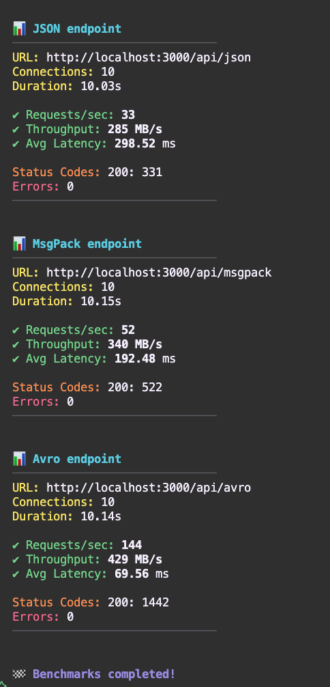

# ADR: Use of Binary Encoding for Inter-Service Communication

**Status**: Proposed

**Date**: 2025-10-22

**Context**:
Our distributed system consists of a BFF and multiple backend microservices (10+). Services communicate primarily through HTTP and Kafka events. Currently, payloads are exchanged using plain JSON. The team is considering introducing binary serialization (e.g., Avro, MessagePack) for internal communication to reduce payload size and enforce schema validation.


## Decision
Adopt a hybrid strategy:

- Frontend ↔ BFF: Continue using JSON (or optionally MessagePack for performance).
- BFF ↔ Backend Services & Service ↔ Service: Use a binary serialization format (Avro or MessagePack) for efficiency and schema enforcement.


**Explanation of diagram**

BFF (in case it will be):
- Acts as a translator and enforcer of the serialization format.
- Decodes incoming requests once.
- Encodes requests to backend services in the binary format (msgpackr/avsc).
- Aggregates multiple backend responses, decodes them, merges, and re-encodes.

Backend Services:
- Each runs with the same encoding/decoding middleware.
- They don’t care if it’s MsgPack or Avro—the shared lib handles it.
- Respond back in the same binary format.


## Comparison
- avsc: https://www.npmjs.com/package/avsc
- msgpackr: https://www.npmjs.com/package/msgpackr

| Criteria                          | JSON (No Encoding)                       | Binary Encoding |
| :-------------------------------- |:----------------------------------------:| ----------------------:|
| Ease of debugging                 | Human-readable; easy to log and inspect. | Harder to debug; needs decoding tools. |
| Tooling & observability           | Simple with existing HTTP tools.         | Requires specific decoding middleware and monitoring. |
| Cross-language support            | Universal.                               | Requires schema management and codegen. |
| Schema enforcement                | Optional                                 | Strong schema validation. |
| Network efficiency                | Larger payload size.                     | Compact; typically 30–60% smaller. |
| Performance (serialization/deserialization)  | Slower due to string parsing. | Much faster; binary formats use efficient codecs. |


// TODO:
## Pros of Encoding (Avro)
- Smaller payloads: Reduces bandwidth usage and latency, especially beneficial for high-throughput Kafka or gRPC streams.
- Stronger contracts: Avro/Protobuf enforce schemas → safer deployments.
- Performance boost: Binary serialization/deserialization can be 3–5× faster.
- Standardization: Enables typed code generation and eliminates manual JSON mapping.

## Pros of Encoding (MsgPack)
- Smaller payloads: Reduces bandwidth usage and latency, especially beneficial for high-throughput Kafka or gRPC streams.
- Stronger contracts: Avro/Protobuf enforce schemas → safer deployments.
- Performance boost: Binary serialization/deserialization can be 3–5× faster.
- Standardization: Enables typed code generation and eliminates manual JSON mapping.

## Cons of Encoding
- Reduced transparency: Debugging logs or inspecting messages on the wire becomes harder.
- Schema governance: Requires a central schema registry and strict version control.
- Monitoring integration: Observability tools (e.g., Datadog, ELK) need adapters for binary payloads.


## Performance Tests
Payload of the response is pre-generated with 100.000 records.

### Operational benchmark (represents number of operations for each step) - 1.000 records:


### A simple request to json (no encoding), msgpack and avro format - 100.000 records:
```
Server is running at http://localhost:3000
[GET] /api/json - Started at: 2025-10-23T14:26:58.152Z, Finished at: 2025-10-23T14:26:58.218Z, Duration: 65.83 ms
[GET] /api/msgpack - Started at: 2025-10-23T14:27:04.807Z, Finished at: 2025-10-23T14:27:04.820Z, Duration: 13.60 ms
[GET] /api/avro - Started at: 2025-10-23T14:27:08.319Z, Finished at: 2025-10-23T14:27:08.333Z, Duration: 14.47 ms
```

### 


