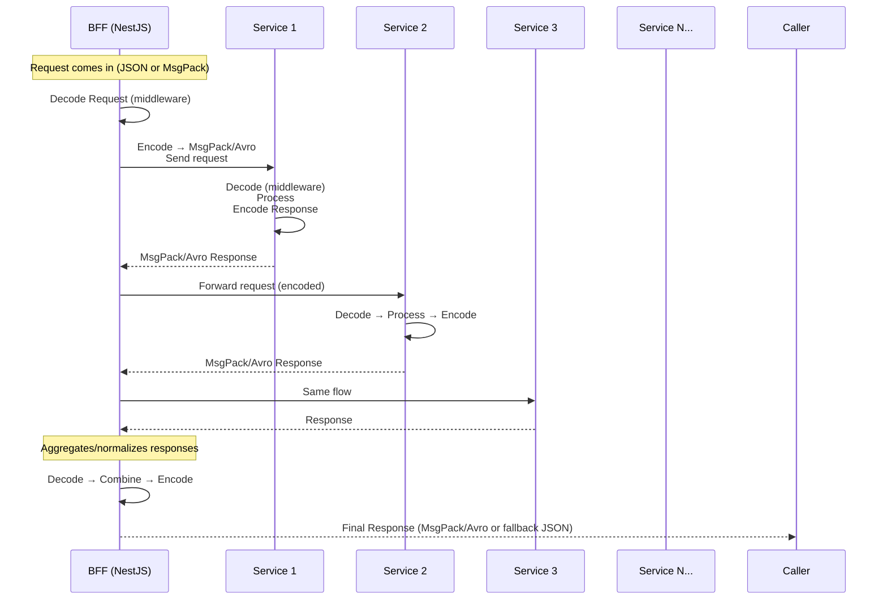
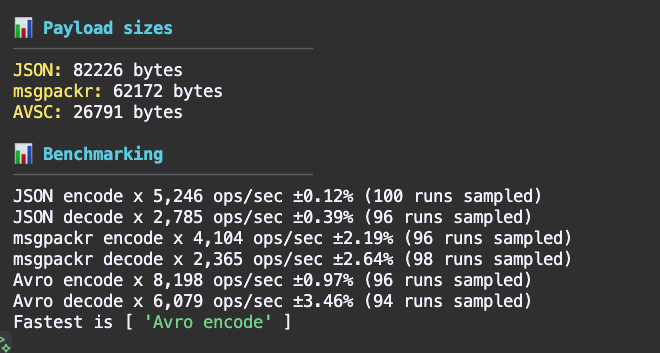
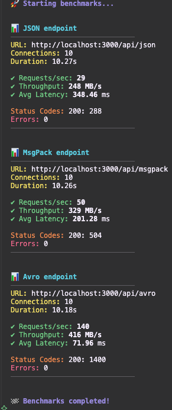
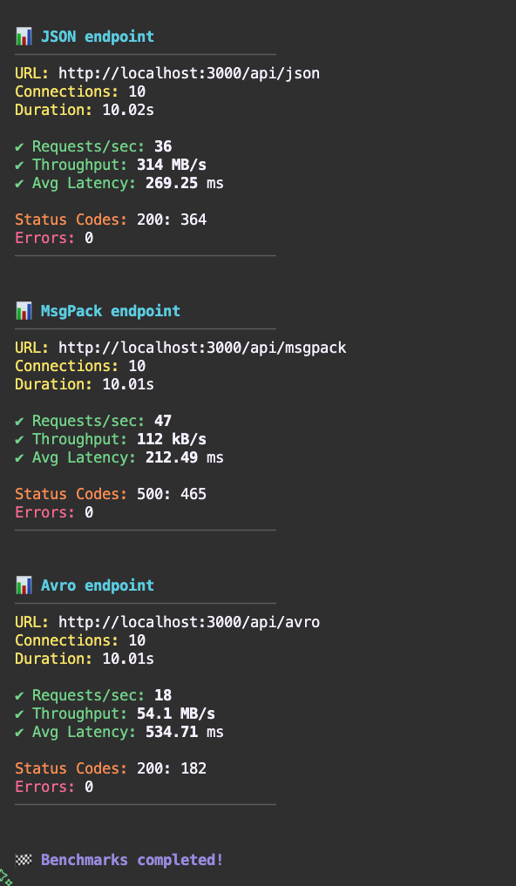

# ADR: Use of Binary Encoding for Inter-Service Communication

**Status**: Proposed

**Date**: 2025-10-22

**Context**:
Our distributed system consists of a BFF and multiple backend microservices (10+). Services communicate primarily through HTTP and Kafka events. Currently, payloads are exchanged using plain JSON. The team is considering introducing binary serialization (e.g., Avro, MessagePack) for internal communication to reduce payload size and enforce schema validation.

## Decision
Adopt a hybrid strategy:

- Frontend ↔ BFF: Continue using JSON (or optionally MessagePack for performance).
- BFF ↔ Backend Services & Service ↔ Service: Use a binary serialization format (Avro or MessagePack) for efficiency and schema enforcement.

**Explanation of diagram**

BFF (in case it will be):
- Acts as a translator and enforcer of the serialization format.
- Decodes incoming requests once.
- Encodes requests to backend services in the binary format (msgpackr/avsc).
- Aggregates multiple backend responses, decodes them, merges, and re-encodes.

Backend Services:
- Each runs with the same encoding/decoding middleware.
- They don’t care if it’s MsgPack or Avro—the shared lib handles it.
- Respond back in the same binary format.

## Comparison
- avsc: https://www.npmjs.com/package/avsc
- msgpackr: https://www.npmjs.com/package/msgpackr

| Criteria                          | JSON (No Encoding)                  | Avro             | MessagePack (msgpackr) |
| :-------------------------------- |:-----------------------------------:| :---------------:| ----------------------:|
| Encoding type                     | Text                                | Binary           | Binary |
| Ease of debugging                 | Human-readable, easy to log.        | Harder           | Harder |
| Tooling & observability           | Simple with existing HTTP tools.    | Harder           | Harder |
| Schema validation                 | None                                | Strong           | None |
| Network efficiency                | Larger payload size.                | Very Compact     | Compact |
| Performance                       | Moderate                            | Slow             | Fast | 

#### Pros of Encoding
- Binary encoding reduces payloads by 30%.
- Stronger contracts (with Avro enforce schemas).
- Performance boost: Binary serialization/deserialization can be 3–5× faster.
- Standardization: Enables typed code generation and eliminates manual JSON mapping.
- Simple integration: Works in browsers and Node.js without schema registries.

#### Cons of Encoding (avro)
- Requires schema management and registry integration.
- Debugging logs or inspecting messages on the wire becomes harder.
- Requires a central schema registry and strict version control.
- Needs decoding tools for inspection.
- Most browsers and frontend frameworks don’t natively support Avro.

#### Cons of Encoding (msgpackr)
- No schema validation.
- Harder to inspect in logs or proxies.

## Performance Tests
#### Operational benchmark (represents number of operations for each step) - 1.000 pre-generated records:

#### Autocannon benchmark (read only, encode once and return the result) - 100.000 records:

#### Autocannon benchmark (getting data from external source, unpacking, packing again before response) - 100.000 records:

