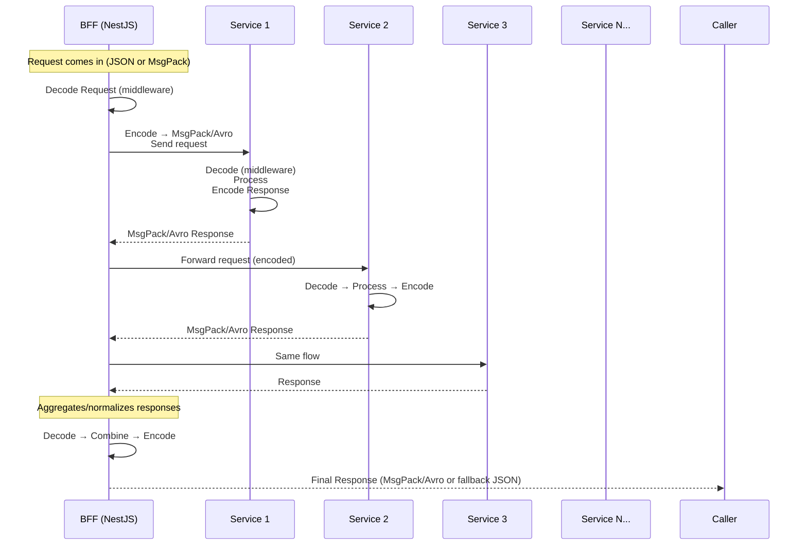

[Architecture Decision Record](ADR.MD)

- Implement dual-mode middleware (JSON ↔ Binary).
- Add schema registry integration (for Avro).
- Measure performance improvements and network savings before full rollout.

## event client
- https://www.asyncapi.com/docs/tutorials/kafka/configure-kafka-avro
- https://github.com/OpenAPITools/openapi-generator/blob/master/docs/generators/avro-schema.md

### Features
- Uniform Encoding Contract
- Encoding/Decoding Middleware: NestJS - decode middleware + encode interceptor. All communicate the same binary format.
- Content Negotiation: Negotiate format, normalize requests/responses (Content-Type: application/json, application/avro)

### Quick rule of thumb

Frontend clients: JSON / MessagePack

Inter-service HTTP / gRPC: Avro (if schemas matter)

Data streaming / Kafka / long-lived pipelines: Avro is the standard

### When Avro is not worth it

Frontend-facing APIs (browser/mobile):
Most browsers and frontend frameworks don’t natively support Avro. You’d need extra libraries, adding bundle size and complexity.
→ Better to use JSON or msgpackr for frontend.

Low-traffic or small payloads:
JSON’s human readability outweighs binary efficiency here.

Rapidly evolving endpoints without schema discipline:
Avro forces schema rigor. If your team isn’t disciplined, you’ll just create friction.

-----
You’ve got Frontend → BFF (Backend-for-Frontend) → 10 backend microservices, and you want all communication to be efficiently serialized with msgpackr or avsc.

Here’s how you’d approach it:

1. Core Principles

Uniform Encoding Contract
Define once: every service must send and receive payloads in a chosen binary format (MessagePack or Avro).

MessagePack (msgpackr) if you want speed + schema-less simplicity.

Avro (avsc) if you want strong schemas and evolution guarantees.

Content Negotiation
Use the Accept and Content-Type headers to decide format:

application/json → send JSON (fallback).

application/x-msgpack → send msgpack.

application/avro → send Avro.

Encoding/Decoding Middleware
Don’t sprinkle pack/unpack everywhere. Build a middleware or interceptor layer in NestJS (and other services) so that every request/response automatically encodes/decodes.

Shared Libraries
Put serializers (msgpackr/avsc) into a shared npm package used by the BFF and all backend services, so they don’t drift apart.

4. Backend Services (Microservices)

Same pattern as NestJS BFF:

Each service runs decode middleware + encode interceptor.

Or, if they’re not NestJS, just add Express/Koa middleware for msgpackr.

For Avro: load schema from shared lib and wrap encode/decode in middleware.

5. BFF as Translator

The BFF becomes the negotiation point:

Talks msgpack/avro with frontend.

Talks msgpack/avro (or even JSON for legacy) with backend services.

Can normalize headers and ensure consistent behavior.

6. Testing in a Distributed Setup

Write an integration test that calls through Frontend → BFF → Service and ensures encoding survives all hops.

7. Scaling Concerns

Schema Registry (for Avro): Keep schemas in a central repo (or Confluent-like registry).

Versioning: If services evolve, use Avro’s backward/forward compatibility or msgpack with “feature flags”.

Monitoring: Add middleware logging to record content-type usage and payload sizes.

Fallback: Always support JSON fallback for clients that can’t handle binary.

In short:

Frontend: decode based on Content-Type.

BFF: negotiate format, normalize requests/responses.

Services: all speak the same binary tongue, thanks to middleware/interceptors.

------

Explanation

BFF:

Acts as a translator and enforcer of the serialization format.

Decodes incoming requests once.

Encodes requests to backend services in the binary format (msgpackr/avsc).

Aggregates multiple backend responses, decodes them, merges, and re-encodes.

Backend Services:

Each runs with the same encoding/decoding middleware.

They don’t care if it’s MsgPack or Avro—the shared lib handles it.

Respond back in the same binary format.

Final Output:
BFF can return to caller either binary (application/x-msgpack / application/avro) or fallback JSON.